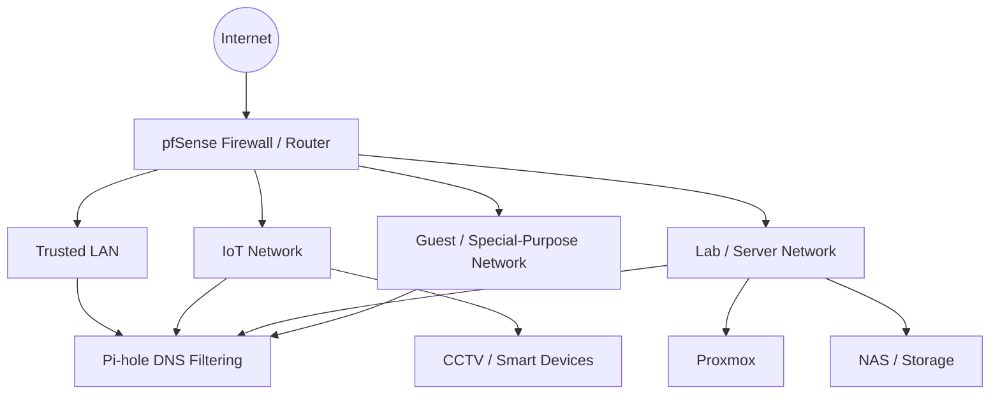

<div align="center">


# WhoAmI

## MikeTechSecurity

**Endpoint Security • Cybersecurity Operations • Network Security • Cloud Administration • Homelab • Automation**

[](https://miketechsecurity.com/)
[](https://github.com/MikeTechSecurity)
[](https://www.youtube.com/@MiketechSecurity)
[](https://www.tiktok.com/@miketechsecurity)
[](https://www.linkedin.com/in/MiketechSecurity)

</div>

---

## About Me

Cybersecurity and endpoint-management professional focused on **endpoint security, EDR/XDR operations, incident response, identity, device management, cloud administration, and defensive security**.

In my professional environment, I work with technologies including **Cortex XDR, Bitdefender, Microsoft Defender for Endpoint, Microsoft Intune, Entra ID, SCCM/MECM, Active Directory, Group Policy, MFA, Conditional Access, Microsoft 365, Google Workspace, and Proofpoint**.

Outside of work, I build and document a practical cybersecurity homelab centered on **pfSense, VLAN segmentation, Pi-hole, Proxmox, Linux, network monitoring, and security automation**.

My approach is simple:

> **Build it. Secure it. Test it. Document it. Improve it.**

---

## Current Focus

- 🔐 Endpoint security, EDR/XDR operations, and incident response
- 🧭 Threat investigation, malware remediation, and device isolation
- 🖥️ Microsoft Intune, Entra ID, SCCM/MECM, Active Directory, and Conditional Access
- ☁️ Microsoft 365, Google Workspace, and cloud administration
- 🧱 pfSense firewall policy and VLAN segmentation
- 🕳️ Pi-hole DNS filtering and group-based network policy
- 🖥️ Proxmox virtualization and isolated lab networking
- 🐧 Linux administration and troubleshooting
- 🐍 Python and PowerShell for utilities and automation
- 📚 Building repeatable documentation from working configurations

---

## Homelab Architecture



> Public documentation is intentionally sanitized. Internal addressing, credentials, secrets, and unnecessary implementation details are not published.

---

## Featured Project

### Pi-hole Blocklists

My Pi-hole blocklist project organizes DNS filtering for different network groups, including trusted systems, IoT devices, kids' devices, and other segmented clients.

[](https://github.com/MikeTechSecurity/pihole-blocklists)

Current filtering areas include:

- General advertising and tracker filtering
- Malware and phishing domain protection
- Adult-content filtering
- Gambling filtering
- Social-network filtering
- Search/SafeSearch-related filtering
- DNS/VPN/proxy bypass controls
- A manually maintained **Mike-OWN-List** for custom network blocks

---

## Technology Stack

### Security & Endpoint


### Identity, Endpoint & Cloud


### Network & Homelab


### Code & Tooling


---

## Projects & Labs

| Project | Focus | Status |
|---|---|---|
| [Pi-hole Blocklists](https://github.com/MikeTechSecurity/pihole-blocklists) | DNS filtering and group-based network policy | 🟢 Active |
| Endpoint Security Lab | EDR/XDR, alert investigation, malware remediation | 🟡 In progress |
| pfSense Homelab | Firewall rules, aliases, VLANs, DNS enforcement | 🟡 In progress |
| Proxmox Lab | Virtual networking, isolated lab segments, VM testing | 🟡 In progress |
| Security Automation | Python and PowerShell admin/security workflows | 🔵 Expanding |

---

## Security Principles

```text
SEGMENT      -> Do not place every device on one flat network.
LEAST ACCESS -> Allow only the traffic a network or device actually needs.
CONTROL DNS  -> Keep DNS predictable, observable, and policy-driven.
LOG & VERIFY -> Check what actually happened instead of assuming a rule worked.
BACK UP      -> Configuration backups are part of security.
DOCUMENT     -> A secure system should also be understandable and maintainable.
TEST SAFELY  -> Security testing belongs in systems you own or are authorized to test.
```

---

## Roadmap

- [ ] Publish a sanitized pfSense network architecture guide
- [ ] Document VLAN and firewall-rule design patterns
- [ ] Publish Pi-hole client/group filtering examples
- [ ] Document Proxmox isolated-network lab designs
- [ ] Add endpoint-security and defensive monitoring lab notes
- [ ] Build more Python and PowerShell security/admin utilities
- [ ] Add backup and recovery documentation for core services

---

<div align="center">

### Secure • Protect • Defend

**MikeTechSecurity**

[Website](https://miketechsecurity.com/) • [GitHub](https://github.com/MikeTechSecurity) • [YouTube](https://www.youtube.com/@MiketechSecurity) • [TikTok](https://www.tiktok.com/@miketechsecurity) • [LinkedIn](https://www.linkedin.com/in/MiketechSecurity)

</div>
