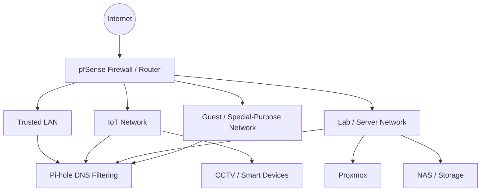

<div align="center">

# WhoAmI

## MikeTechSecurity

**Endpoint Security • Cybersecurity Operations • Cloud Administration**

[](https://miketechsecurity.com/)
[](https://github.com/MikeTechSecurity)
[](https://www.linkedin.com/in/MiketechSecurity)
[](https://www.youtube.com/@MiketechSecurity)
[](https://www.tiktok.com/@miketechsecurity)

</div>

---

## Professional Profile

Cybersecurity and endpoint-management professional responsible for endpoint security, antivirus, and EDR operations across a multi-campus environment. I manage enterprise endpoint-security platforms, investigate security alerts and suspicious activity, coordinate remediation, and build endpoint-compliance and access controls across Microsoft identity, device-management, and cloud services.

My work sits at the intersection of **endpoint security, incident response, identity, device management, cloud administration, and defensive cybersecurity**.

> **Build it. Secure it. Monitor it. Document it. Improve it.**

---

## Current Role

### Systems and Endpoint Security Coordinator — Jackson College

- Primary administrator and point of accountability for endpoint cybersecurity, antivirus, and EDR operations.
- Manage **Cortex XDR, Bitdefender, and Microsoft Defender for Endpoint** across endpoint environments.
- Deploy agents, configure policies and exclusions, maintain protection standards, and monitor platform health.
- Investigate malware, security alerts, and suspicious endpoint activity; isolate devices, remove threats, document findings, and coordinate remediation.
- Develop and enforce endpoint compliance, encryption, device-protection, MFA, and access-control standards.
- Serve as an advanced escalation resource and coordinate security deployments with vendors and internal teams.

---

## Enterprise Security & Administration Stack

### Endpoint Security / EDR


### Identity, Endpoint & Cloud Administration


### Security Operations

- EDR / antivirus policy management
- Alert monitoring and triage
- Threat investigation
- Malware remediation
- Endpoint isolation
- Incident response coordination
- Endpoint compliance and encryption
- MFA and Conditional Access
- Security platform deployment
- Technical documentation and staff training

---

## Cybersecurity Experience

### Collegiate Cyber Defense Competition

I participate in team-based cyber defense competitions where Windows and Linux systems must be secured and maintained while under simulated attack.

Typical responsibilities include:

- Hardening Windows and Linux systems
- Applying patches and security controls
- Configuring and validating firewall policy
- Investigating incidents
- Maintaining required business services
- Communicating technical status under time pressure

---

## Homelab & Defensive Security Projects

My homelab gives me a place to test network segmentation, DNS security, virtualization, firewall policy, and infrastructure changes in an environment I control.



Public documentation is intentionally sanitized. Credentials, secrets, unnecessary internal details, and sensitive configuration data are not published.

---

## Featured Project — Pi-hole Blocklists

My [Pi-hole Blocklists](https://github.com/MikeTechSecurity/pihole-blocklists) project organizes DNS filtering for segmented network groups including trusted devices, IoT, kids' devices, and special-purpose clients.

Filtering areas include:

- Advertising and tracking
- Malware and phishing domains
- Adult-content filtering
- Gambling filtering
- Social-network filtering
- SafeSearch-related controls
- DNS/VPN/proxy bypass controls
- My manually maintained **Mike-OWN-List**

---

## Additional Homelab Technologies


---

## Education

- **Bachelor's Studies — Information Assurance and Cybersecurity**, Eastern Michigan University — In Progress
- **AAS — Networking Specialist**, Jackson College — 2024
- **AAS — Cybersecurity**, Jackson College — 2023
- **AAS — Cloud Networking**, Jackson College — 2023
- **Certificate — Computer Support Specialist**, Jackson College — 2021

---

## Selected Certifications & Training

- Google AI Essentials
- Proofpoint Certified AI Data Security Specialist 2025
- Palo Alto Networks Cybersecurity Fundamentals: Security Solutions
- Proofpoint email, identity-threat, and PhishAlarm training
- Microsoft Intune / Microsoft 365 / Active Directory training
- AWS Cloud Quest: Cloud Practitioner

---

## Projects & Labs

| Project | Focus | Status |
|---|---|---|
| [Pi-hole Blocklists](https://github.com/MikeTechSecurity/pihole-blocklists) | DNS filtering and group-based security policy | 🟢 Active |
| Endpoint Security Lab | EDR policy, alert investigation, remediation workflows | 🟡 Ongoing |
| pfSense Homelab | Firewall rules, VLANs, aliases, DNS enforcement | 🟡 Ongoing |
| Proxmox Lab | Virtual networking, VMs, isolated lab segments | 🟡 Ongoing |
| Security Automation | Python and PowerShell administration/security utilities | 🔵 Expanding |

---

## Security Principles

```text
VISIBILITY   -> Know what is happening on endpoints and networks.
SEGMENT      -> Avoid flat networks and unnecessary trust relationships.
LEAST ACCESS -> Give users, devices, and services only what they need.
CONTROL DNS  -> Keep name resolution observable and policy-driven.
VERIFY       -> Validate controls instead of assuming they worked.
DOCUMENT     -> Security must be understandable and maintainable.
RESPOND      -> Investigate, contain, remediate, and learn from incidents.
TEST SAFELY  -> Perform security testing only on systems you own or are authorized to test.
```

---

<div align="center">

### Endpoint Security • Cybersecurity Operations • Cloud Administration

**MikeTechSecurity**

[Website](https://miketechsecurity.com/) • [GitHub](https://github.com/MikeTechSecurity) • [LinkedIn](https://www.linkedin.com/in/MiketechSecurity) • [YouTube](https://www.youtube.com/@MiketechSecurity) • [TikTok](https://www.tiktok.com/@miketechsecurity)

</div>
