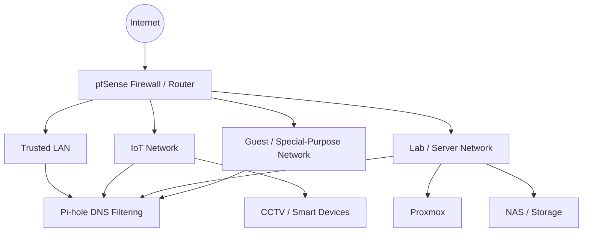

<div align="center">

# WhoAmI

## MikeTechSecurity

**Cybersecurity • Network Security • Homelab • Infrastructure • Automation**

[](https://miketechsecurity.com/)
[](https://github.com/MikeTechSecurity)
[](https://www.youtube.com/@MiketechSecurity)
[](https://www.tiktok.com/@miketechsecurity)
[](https://www.linkedin.com/in/MiketechSecurity)

</div>

---

## About Me

I build, secure, test, and document practical home-lab infrastructure with a focus on **network segmentation, DNS filtering, firewall policy, virtualization, and defensive security**.

This repository is my public **WhoAmI** page — a central place for the systems I am building, the tools I use, and the projects I continue improving.

My approach is simple:

> **Build it. Secure it. Test it. Document it. Improve it.**

---

## Current Focus

- 🔐 Designing and refining **pfSense firewall policy**
- 🧱 Separating trusted, IoT, guest, lab, and special-purpose devices with **VLANs**
- 🕳️ Managing network-wide DNS filtering with **Pi-hole**
- 🖥️ Building virtual lab environments with **Proxmox**
- 🐧 Expanding Linux administration and troubleshooting skills
- 🐍 Using **Python** for utilities, learning projects, and automation
- 🧪 Testing security controls in a controlled home-lab environment
- 📚 Turning working configurations into repeatable documentation

---

## Homelab Architecture



> Public documentation is intentionally sanitized. Internal addressing, credentials, secrets, and unnecessary implementation details are not published.

---

## Featured Project

### Pi-hole Blocklists

My Pi-hole blocklist project organizes DNS filtering for different network groups, including trusted systems, IoT devices, kids' devices, and other segmented clients.

[](https://github.com/MikeTechSecurity/pihole-blocklists)

Current filtering areas include:

- General advertising and tracker filtering
- Malware and phishing domain protection
- Adult-content filtering
- Gambling filtering
- Social-network filtering
- Search/SafeSearch-related filtering
- DNS/VPN/proxy bypass controls
- A manually maintained **Mike-OWN-List** for custom network blocks

---

## Technology Stack

### Network & Security


### Virtualization & Systems


### Code & Tooling


---

## Projects & Labs

| Project | Focus | Status |
|---|---|---|
| [Pi-hole Blocklists](https://github.com/MikeTechSecurity/pihole-blocklists) | DNS filtering and group-based network policy | 🟢 Active |
| pfSense Homelab | Firewall rules, aliases, VLANs, DNS enforcement | 🟡 In progress |
| Proxmox Lab | Virtual networking, isolated lab segments, VM testing | 🟡 In progress |
| Network Documentation | Diagrams, addressing strategy, service inventory | 🟡 In progress |
| Security Automation | Small scripts and repeatable admin workflows | 🔵 Expanding |

---

## Security Principles

```text
SEGMENT      -> Do not place every device on one flat network.
LEAST ACCESS -> Allow only the traffic a network or device actually needs.
CONTROL DNS  -> Keep DNS predictable, observable, and policy-driven.
LOG & VERIFY -> Check what actually happened instead of assuming a rule worked.
BACK UP      -> Configuration backups are part of security.
DOCUMENT     -> A secure system should also be understandable and maintainable.
TEST SAFELY  -> Security testing belongs in systems you own or are authorized to test.
```

---

## Roadmap

- [ ] Publish a sanitized pfSense network architecture guide
- [ ] Document VLAN and firewall-rule design patterns
- [ ] Publish Pi-hole client/group filtering examples
- [ ] Document Proxmox isolated-network lab designs
- [ ] Add network monitoring and alerting projects
- [ ] Build more Python and PowerShell security/admin utilities
- [ ] Add backup and recovery documentation for core services

---

## Repository Philosophy

I prefer projects that are:

- **Practical** — useful in a real environment
- **Reproducible** — documented well enough to build again
- **Defensive** — focused on hardening, visibility, and controlled testing
- **Maintainable** — simple enough to troubleshoot later
- **Sanitized** — public documentation should not expose secrets or unnecessary internal details

---

<div align="center">

### Build • Secure • Test • Document • Improve

**MikeTechSecurity**

[Website](https://miketechsecurity.com/) • [GitHub](https://github.com/MikeTechSecurity) • [YouTube](https://www.youtube.com/@MiketechSecurity) • [TikTok](https://www.tiktok.com/@miketechsecurity) • [LinkedIn](https://www.linkedin.com/in/MiketechSecurity)

</div>
